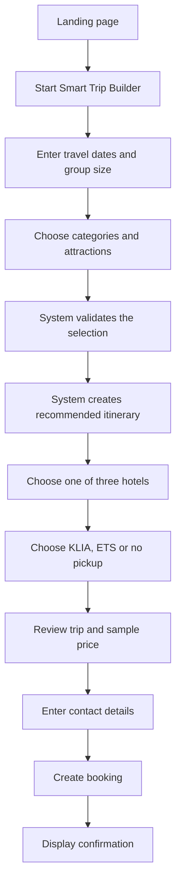

# Mali2Ipoh Smart Trip Builder

## Next.js Landing Page, Booking Flow and Admin Panel Development Guide

This document is a development blueprint for building the Mali2Ipoh Proof of Concept in Next.js and running it locally in VS Code.

The POC demonstrates how an overseas traveller can select Ipoh attractions, receive a system-generated trip recommendation, choose a hotel and arrival pickup, submit a booking, and have an admin assign a suitable tour guide who is also responsible for driving.

---

# 1. Product Summary

## Product name

**Mali2Ipoh Smart Trip Builder**

## Product promise

> Choose what you love. We will build the best way to experience it.

## Target audience

- 80% overseas travellers
- 20% local travellers
- Couples, families and small private groups
- Travellers arriving through KLIA or Ipoh ETS

## Controlled customisation

Customers build a trip using approved options rather than submitting an unrestricted itinerary request.

The four destination categories are:

1. Famous Landmarks
2. Local Food
3. Heritage & Culture
4. Nature

Customers also provide:

- Travel dates
- Number of adults and children
- Selected attractions
- One of three hotels
- KLIA pickup, Ipoh ETS pickup or no pickup
- Contact and travel requirements

The system then:

- Checks whether the selection fits the trip duration
- Suggests a practical itinerary order
- Calculates a sample total
- Creates a booking
- Recommends an available guide
- Allows the admin to confirm or change the guide

---

# 2. POC Scope

## Included in the POC

- Responsive public landing page
- Overseas-traveller-focused content
- Four destination categories
- Attraction-selection interface
- Multi-step Smart Trip Builder
- Group-size input
- Three hotel choices
- KLIA, Ipoh ETS and no-pickup options
- Sample itinerary generation
- Sample price calculation
- Booking review and confirmation
- Mock admin login
- Admin dashboard
- Booking list and booking details
- Tour-guide directory
- Guide recommendation and assignment
- Popular destination and combination analytics
- Local mock-data persistence

## Not required for the first POC

- Real payment processing
- Real hotel inventory
- Live flight or ETS tracking
- Maps route optimisation
- Production authentication
- Real email or WhatsApp delivery
- A production database
- Automatic guide payroll or bonuses
- Full AI or machine-learning recommendations

The first POC should prove the product journey. External services can be integrated after the team validates the concept.

---

# 3. Recommended Technical Approach

## Core stack

- Next.js with App Router
- JavaScript
- Tailwind CSS
- React Server and Client Components
- Route Handlers or Server Actions where useful
- React Context or a small local store for POC state
- Browser `localStorage` for bookings and assignments during the POC
- Static JavaScript or JSON files for destinations, hotels and guides

## Why this approach

- One project contains the landing page, trip builder and admin panel.
- No database setup is required for the initial demonstration.
- The project runs entirely on localhost.
- Mock data can later be replaced with database queries.
- The same routes and components can later be deployed as a production application.

## POC limitation

`localStorage` stores data only in the current browser. Bookings will not be shared with another device and may be lost if browser data is cleared. This is acceptable for a local POC but must be replaced with a database for production.

---

# 4. Customer Journey



## Required customer decisions

- Travel dates
- Group size
- Preferred places
- Hotel
- Arrival option
- Whether to accept or adjust the recommendation

## System decisions

- Whether the selected attractions fit the available time
- Recommended order of attractions
- Suggested daily itinerary
- Recommended hotel
- Appropriate guide based on availability and suitability
- Sample price

---

# 5. Public Routes

| Route | Purpose |
| --- | --- |
| `/` | Main landing page |
| `/destinations` | Browse all four destination categories |
| `/trip-builder` | Multi-step custom trip builder |
| `/trip-builder/recommendation` | Generated itinerary and price preview |
| `/checkout` | Traveller and contact information |
| `/booking/confirmation/[id]` | Booking confirmation |
| `/about` | Company story and trust information |
| `/help` | FAQ, travel information and contact support |

For a short POC, `/destinations`, `/about` and `/help` may be sections on the homepage instead of separate routes.

---

# 6. Landing Page Specification

## Section 1: Header

Include:

- Mali2Ipoh logo
- Explore Ipoh
- How It Works
- About Us
- Help
- `Build My Trip` primary CTA
- Language selector placeholder

For overseas travellers, English should be the default language.

## Section 2: Hero

Purpose: explain the product within a few seconds.

Content direction:

- Strong Ipoh destination image or short video
- Clear customisation message
- Explanation that the system helps build the itinerary
- Primary CTA to start the trip builder
- Secondary CTA to explore destinations

Trust indicators:

- Ipoh-based local team
- English-speaking support
- KLIA and Ipoh ETS pickup
- Personalised itinerary
- Secure booking placeholder

## Section 3: Why Ipoh

Because 80% of the audience is overseas, explain:

- Where Ipoh is located
- What makes Ipoh different
- Suggested travel duration
- Connection from Kuala Lumpur, KLIA and other Malaysian destinations
- Key themes: food, heritage, limestone scenery and local culture

## Section 4: Four Ways to Experience Ipoh

Display the four categories:

- Famous Landmarks
- Local Food
- Heritage & Culture
- Nature

Each category should contain:

- Cover image
- One-sentence description
- A few featured attractions
- `Explore Category` action

Do not display every attraction in a single long homepage section. The complete attraction list belongs in the trip builder or destinations page.

## Section 5: How It Works

Use five simple steps:

1. Tell us about your trip.
2. Choose the places you love.
3. Receive a recommended itinerary.
4. Add hotel and arrival pickup.
5. Confirm your booking.

## Section 6: Smart Trip Builder Preview

Show a preview of how recommendations work. Explain that the system considers:

- Available time
- Attraction location
- Opening hours
- Group size
- Hotel choice
- Arrival point

## Section 7: Hotel Choices

Preview the three approved hotel options. Each hotel card should show:

- Image
- Hotel name
- Location
- Rating or category
- Room capacity
- Key facilities
- Starting price

## Section 8: Arrival Options

Explain:

- KLIA pickup
- Ipoh ETS pickup
- No pickup required

The final transfer recommendation depends on group and luggage size.

## Section 9: Why Choose Mali2Ipoh

Cover:

- Controlled flexibility
- Local knowledge
- One guide throughout the experience
- Arrival-to-tour convenience
- International-traveller support
- Clear itinerary and pricing

## Section 10: Reviews

Use sample POC reviews clearly marked as mock content until real customer reviews are available.

Prioritise review layouts that show:

- Traveller country
- Experience type
- Rating
- Short feedback

## Section 11: Final CTA

End with one primary action:

`Build My Ipoh Trip`

---

# 7. Smart Trip Builder Specification

The builder should be a multi-step interface with a progress indicator and persistent selections.

## Step 1: Trip basics

Fields:

- Arrival date
- Departure date
- Adults
- Children
- Children ages when applicable
- Nationality
- Preferred language

Validation:

- Departure date must be after arrival date.
- At least one traveller is required.
- Group size must remain within supported vehicle capacity.

## Step 2: Select categories and attractions

Display category tabs or filters.

Each destination card should contain:

- Image
- Name
- Category
- Short explanation
- Estimated visit duration
- Entrance fee indicator
- Recommended traveller type
- Accessibility indicator
- `Add` or `Remove` action

Show a selection summary that remains visible while the customer browses.

## Step 3: Validate and recommend itinerary

The system should:

- Calculate the available touring time.
- Sum estimated attraction durations.
- Add estimated travel and meal buffers.
- Warn when the selection is too full.
- Group nearby destinations.
- Place time-sensitive attractions in suitable slots.
- Produce a day-by-day recommendation.

For the POC, use deterministic rules and sample travel-time values. Do not claim live route optimisation.

## Step 4: Hotel selection

Display exactly three options.

The system may recommend one based on:

- Group size
- Selected destination areas
- Trip length
- Sample budget level

The customer remains free to choose another hotel.

## Step 5: Arrival selection

Options:

### KLIA pickup

Collect:

- Terminal
- Airline
- Flight number
- Arrival time
- Luggage quantity
- Oversized luggage indicator

### Ipoh ETS pickup

Collect:

- Train number
- Departure station
- Arrival time
- Luggage quantity

### No pickup

Collect:

- Meeting location
- Expected arrival time

## Step 6: Review and price

Display:

- Dates and travellers
- Selected attractions
- Recommended itinerary
- Hotel and number of nights
- Arrival pickup
- Guide service
- Sample entrance fees
- Sample transportation charge
- Sample taxes or service charges
- Final POC total

Label prices as sample values until production pricing rules are approved.

## Step 7: Traveller details

Collect:

- Full name
- Nationality
- Email
- WhatsApp number with international country code
- Emergency contact
- Dietary requirements
- Accessibility requirements
- Special notes

Do not require account creation for the POC.

## Step 8: Confirmation

Generate:

- Booking reference
- Booking status
- Itinerary summary
- Hotel choice
- Pickup summary
- Customer details
- `View Booking` action

---

# 8. Recommendation Logic for the POC

## Important principle

Customers select what interests them, but the system helps decide what is practical.

## Attraction-fit calculation

Every attraction should have metadata:

- Category
- Estimated duration
- Area or zone
- Opening time
- Closing time
- Available weekdays
- Suitability tags
- Accessibility tags
- Sample entrance fee
- Popularity score

## Basic itinerary rules

1. Determine the number of available tour days.
2. Define usable touring hours for each day.
3. Reserve time for meals and transportation.
4. Sort selected attractions by area and opening constraints.
5. Add attractions while remaining daily time is sufficient.
6. Move overflow attractions to another day.
7. If no time remains, recommend removing or replacing the lowest-priority item.

## Guide recommendation rules

Filter out guides who:

- Are unavailable
- Cannot support the group size
- Cannot support the luggage requirement
- Do not provide the selected pickup type
- Do not speak the required language

Score remaining guides using:

- Language match
- Expertise match with selected categories
- International-traveller experience
- Group-type experience
- Customer rating
- Workload balance

The POC should display:

- Recommended guide
- Match score
- Reasons for recommendation
- Alternative available guides

The admin confirms the recommendation or chooses an alternative.

---

# 9. Admin Routes

| Route | Purpose |
| --- | --- |
| `/admin/login` | Mock admin login |
| `/admin` | Dashboard overview |
| `/admin/bookings` | Booking list |
| `/admin/bookings/[id]` | Booking details and guide assignment |
| `/admin/guides` | Guide directory |
| `/admin/guides/[id]` | Guide profile and schedule |
| `/admin/destinations` | Destination list and metadata |
| `/admin/hotels` | Three hotel records |
| `/admin/analytics` | Popular selections and performance |

---

# 10. Admin Panel Specification

## Admin login

For the POC, use a clearly documented demo login rather than implementing production authentication.

Example:

- Email: `admin@mali2ipoh.test`
- Password: stored in a local environment variable

Do not hard-code real company passwords.

## Dashboard

Summary cards:

- Total bookings
- Upcoming tours
- Bookings awaiting guide assignment
- KLIA pickups
- ETS pickups
- Completed tours

Operational sections:

- Upcoming bookings
- Missing information
- Guide conflicts
- Popular attractions
- Popular attraction combinations

## Booking list

Columns:

- Booking ID
- Traveller
- Country
- Travel date
- Group size
- Hotel
- Arrival option
- Payment status
- Guide
- Booking status

Filters:

- Date
- Status
- Guide assignment
- Arrival option
- Hotel
- Nationality

## Booking details

Display:

- Customer details
- Dates and group size
- Selected destinations
- Recommended itinerary
- Hotel
- Flight or ETS information
- Luggage
- Dietary and accessibility requirements
- Sample price breakdown
- Booking-status history
- Recommended guide
- Alternative guides

Admin actions:

- Accept booking
- Assign recommended guide
- Select another guide
- Update status
- Add internal note
- Cancel booking

## Guide directory

Each guide record should contain:

- Name
- Photo
- Contact information
- Languages
- Category expertise
- International-traveller experience
- Available dates
- Assigned bookings
- Rating
- Completed-tour count
- KLIA pickup capability
- ETS pickup capability
- Vehicle type
- Passenger capacity
- Passenger capacity with luggage
- Vehicle-registration placeholder
- Licence and insurance status placeholders

## Analytics

Track:

- Most viewed attractions
- Most added attractions
- Most removed attractions
- Most booked attractions
- Most common combinations
- Most booked category
- Average group size
- Hotel selection distribution
- KLIA versus ETS demand
- Guide assignment distribution

For the POC, generate analytics from locally stored sample bookings.

---

# 11. Recommended Booking Statuses

Main flow:

1. `DRAFT`
2. `PENDING_CONFIRMATION`
3. `CONFIRMED`
4. `GUIDE_ASSIGNED`
5. `READY`
6. `IN_PROGRESS`
7. `COMPLETED`

Exception statuses:

- `INFORMATION_REQUIRED`
- `CHANGE_REQUESTED`
- `CANCELLED`
- `REFUNDED`
- `NO_SHOW`

For the first POC, a booking may be created as `PENDING_CONFIRMATION`. The admin accepts it and assigns a guide.

---

# 12. JavaScript Data Models

Use these as starting JavaScript objects and constants, then adjust during development.

```js
export const DESTINATION_CATEGORIES = {
  FAMOUS_LANDMARKS: "FAMOUS_LANDMARKS",
  LOCAL_FOOD: "LOCAL_FOOD",
  HERITAGE_CULTURE: "HERITAGE_CULTURE",
  NATURE: "NATURE",
};

export const PICKUP_OPTIONS = {
  KLIA: "KLIA",
  ETS: "ETS",
  SELF_ARRIVAL: "SELF_ARRIVAL",
};

export const BOOKING_STATUSES = {
  DRAFT: "DRAFT",
  PENDING_CONFIRMATION: "PENDING_CONFIRMATION",
  CONFIRMED: "CONFIRMED",
  GUIDE_ASSIGNED: "GUIDE_ASSIGNED",
  READY: "READY",
  IN_PROGRESS: "IN_PROGRESS",
  COMPLETED: "COMPLETED",
  INFORMATION_REQUIRED: "INFORMATION_REQUIRED",
  CHANGE_REQUESTED: "CHANGE_REQUESTED",
  CANCELLED: "CANCELLED",
  REFUNDED: "REFUNDED",
  NO_SHOW: "NO_SHOW",
};

export const destinationExample = {
  id: "dest-kek-lok-tong",
  name: "Kek Lok Tong Cave Temple",
  slug: "kek-lok-tong-cave-temple",
  category: DESTINATION_CATEGORIES.FAMOUS_LANDMARKS,
  description: "A dramatic cave temple with peaceful gardens and easy visitor access.",
  image: "/images/destinations/kek-lok-tong.jpg",
  zone: "Gunung Rapat",
  estimatedMinutes: 90,
  openingTime: "08:00",
  closingTime: "17:00",
  availableDays: [0, 1, 2, 3, 4, 5, 6],
  entranceFeeMYR: 0,
  tags: ["cave", "photography", "first-time visitors"],
  accessibilityTags: ["step-light", "family-friendly"],
  popularityScore: 92,
};

export const hotelExample = {
  id: "hotel-old-town",
  name: "Sekeping Kong Heng",
  description: "A design-led heritage stay suited for couples and culture-focused travellers.",
  image: "/images/hotels/sekeping-kong-heng.jpg",
  zone: "Old Town",
  pricePerNightMYR: 420,
  roomCapacity: 2,
  facilities: ["Heritage setting", "Cafe access", "Courtyard", "Walkable area"],
};

export const guideExample = {
  id: "guide-joanne",
  name: "Joanne Lim",
  photo: "/images/guides/joanne-lim.jpg",
  email: "joanne@mali2ipoh.test",
  phone: "+60 12-800 1104",
  languages: ["English", "Malay", "Mandarin"],
  expertise: [
    DESTINATION_CATEGORIES.HERITAGE_CULTURE,
    DESTINATION_CATEGORIES.NATURE,
  ],
  internationalTravellerExperience: true,
  pickupCapabilities: [PICKUP_OPTIONS.KLIA, PICKUP_OPTIONS.ETS],
  vehicleType: "Toyota Alphard",
  maxPassengers: 5,
  maxPassengersWithLuggage: 4,
  rating: 4.9,
  completedTours: 173,
  unavailableDates: ["2026-09-01", "2026-10-11"],
};

export const travellerDetailsExample = {
  fullName: "Aisyah Rahman",
  nationality: "Singapore",
  email: "aisyah@example.com",
  whatsapp: "+65 8123 4567",
  emergencyContact: "+65 9000 1111",
  dietaryRequirements: "Halal meals preferred",
  accessibilityRequirements: "",
  specialNotes: "Arriving with one elderly parent",
};

export const itineraryDayExample = {
  dayNumber: 1,
  date: "2026-09-20",
  destinationIds: ["dest-kek-lok-tong", "dest-concubine-lane"],
  estimatedMinutes: 360,
};

export const bookingExample = {
  id: "booking-001",
  reference: "M2I-20260920-001",
  createdAt: "2026-08-14T10:00:00.000Z",
  arrivalDate: "2026-09-20",
  departureDate: "2026-09-23",
  adults: 2,
  children: 1,
  selectedDestinationIds: ["dest-kek-lok-tong", "dest-concubine-lane"],
  recommendedItinerary: [itineraryDayExample],
  hotelId: "hotel-old-town",
  arrivalOption: PICKUP_OPTIONS.KLIA,
  arrivalDetails: {
    terminal: "KLIA 1",
    airline: "Malaysia Airlines",
    flightNumber: "MH123",
    arrivalTime: "11:30",
    luggageQuantity: 3,
    oversizedLuggage: false,
  },
  traveller: travellerDetailsExample,
  totalMYR: 2480,
  status: BOOKING_STATUSES.PENDING_CONFIRMATION,
  recommendedGuideId: "guide-joanne",
  assignedGuideId: "guide-joanne",
};
```

---

# 13. Recommended Project Structure

```text
mali2ipoh/
├── public/
│   ├── images/
│   │   ├── destinations/
│   │   ├── hotels/
│   │   └── guides/
│   └── logo.svg
├── src/
│   ├── app/
│   │   ├── (public)/
│   │   │   ├── page.js
│   │   │   ├── destinations/page.js
│   │   │   ├── trip-builder/page.js
│   │   │   ├── checkout/page.js
│   │   │   └── booking/confirmation/[id]/page.js
│   │   ├── admin/
│   │   │   ├── layout.js
│   │   │   ├── login/page.js
│   │   │   ├── page.js
│   │   │   ├── bookings/page.js
│   │   │   ├── bookings/[id]/page.js
│   │   │   ├── guides/page.js
│   │   │   ├── guides/[id]/page.js
│   │   │   ├── destinations/page.js
│   │   │   ├── hotels/page.js
│   │   │   └── analytics/page.js
│   │   ├── api/
│   │   │   ├── bookings/route.js
│   │   │   └── recommendations/route.js
│   │   ├── globals.css
│   │   └── layout.js
│   ├── components/
│   │   ├── public/
│   │   ├── trip-builder/
│   │   ├── admin/
│   │   └── shared/
│   ├── data/
│   │   ├── destinations.js
│   │   ├── hotels.js
│   │   ├── guides.js
│   │   └── sample-bookings.js
│   ├── lib/
│   │   ├── itinerary-engine.js
│   │   ├── guide-matcher.js
│   │   ├── pricing.js
│   │   ├── storage.js
│   │   └── validators.js
│   ├── providers/
│   │   └── trip-builder-provider.jsx
│   └── types/
│       └── index.js
├── .env.local
├── package.json
└── README.md
```

Route groups such as `(public)` organise files without changing the URL.

---

# 14. VS Code and Localhost Setup

## Step 1: Install required applications

Install:

1. Visual Studio Code
2. Node.js LTS
3. Git

Use a currently supported Node.js LTS release. At the time this guide was prepared, Node.js 24 is an LTS line. Avoid unsupported Node.js releases.

## Step 2: Verify Node.js and npm

Open Terminal on macOS, or the VS Code integrated terminal, and run:

```bash
node --version
npm --version
git --version
```

Each command should display a version number.

If `node` or `npm` is not recognised, install Node.js LTS, close Terminal and VS Code, reopen them, and run the checks again.

## Step 3: Choose a parent folder

Example:

```bash
cd ~/Documents
```

Do not manually create the `mali2ipoh` folder before the next command unless you intend to initialise the app inside an existing empty folder.

## Step 4: Create the Next.js project

Run:

```bash
npx create-next-app@latest mali2ipoh --tailwind --eslint --app --src-dir --import-alias "@/*"
```

If the CLI asks additional questions, recommended selections are:

- React Compiler: choose the default or `Yes` for a new POC
- Use App Router: `Yes`
- Use Turbopack: `Yes`
- Custom import alias: keep `@/*`
- Coding-agent instruction files: optional; choose based on your team's workflow

The CLI creates the project and installs its dependencies automatically.

## Step 5: Open the project in VS Code

```bash
cd mali2ipoh
code .
```

If the `code` command is unavailable:

1. Open VS Code.
2. Select **File → Open Folder**.
3. Choose the `mali2ipoh` folder.

To enable the `code` command on macOS:

1. Open the Command Palette with `Command + Shift + P`.
2. Search for `Shell Command: Install 'code' command in PATH`.
3. Select it and restart Terminal.

## Step 6: Run the development server

In the VS Code terminal:

```bash
npm run dev
```

Open:

```text
http://localhost:3000
```

The page updates automatically when files are saved.

To stop the server, click the terminal and press:

```text
Control + C
```

## Step 7: If port 3000 is already used

Next.js may automatically suggest another port. You can also run:

```bash
npm run dev -- -p 3001
```

Then open:

```text
http://localhost:3001
```

## Step 8: Create the environment file

Create `.env.local` in the project root:

```env
NEXT_PUBLIC_APP_NAME=Mali2Ipoh
DEMO_ADMIN_EMAIL=admin@mali2ipoh.test
DEMO_ADMIN_PASSWORD=change-this-for-local-demo
```

Restart `npm run dev` after changing environment variables.

Do not commit real passwords or secrets to Git.

## Step 9: Recommended VS Code extensions

- ESLint
- Prettier
- Tailwind CSS IntelliSense
- Error Lens, optional
- GitLens, optional

The project can run without optional extensions.

---

# 15. Suggested Development Order

## Phase 1: Foundation

- Create the Next.js project.
- Confirm localhost works.
- Define colours, typography and layout spacing.
- Create shared header, footer, button and container components.
- Add JavaScript constants, objects and JSDoc model notes if useful.
- Add destination, hotel and guide mock data.

## Phase 2: Landing page

- Build the header and hero.
- Add Why Ipoh content.
- Add four category previews.
- Add How It Works.
- Add hotel and pickup previews.
- Add trust and final CTA sections.
- Test mobile, tablet and desktop layouts.

## Phase 3: Trip Builder

- Create the builder state provider.
- Build the progress indicator.
- Add trip basics.
- Add attraction selection.
- Add hotel selection.
- Add arrival selection.
- Add review page.
- Add validation and back/next navigation.

## Phase 4: Decision logic

- Build attraction-duration validation.
- Build sample itinerary ordering.
- Build sample pricing.
- Build guide eligibility filtering.
- Build guide scoring and recommendation reasons.

## Phase 5: Booking

- Add traveller-information form.
- Generate booking reference.
- Store booking locally.
- Build confirmation page.
- Seed additional sample bookings for the admin dashboard.

## Phase 6: Admin panel

- Create mock admin login.
- Create admin sidebar and layout.
- Build dashboard statistics.
- Build booking table and filters.
- Build booking-details page.
- Build guide list and profile.
- Add guide recommendation and assignment.
- Build analytics from mock bookings.

## Phase 7: QA and presentation preparation

- Test the complete overseas-traveller journey.
- Test invalid dates and zero travellers.
- Test excessive attraction selections.
- Test all three arrival options.
- Test group sizes that exceed guide vehicle capacity.
- Test guide availability conflicts.
- Test mobile layout.
- Run lint and production build.

---

# 16. Useful Development Commands

Run locally:

```bash
npm run dev
```

Check linting:

```bash
npm run lint
```

Create a production build:

```bash
npm run build
```

Run the production build locally:

```bash
npm run start
```

If dependencies already exist in `package.json` but `node_modules` is missing:

```bash
npm install
```

Do not run `npm install` repeatedly unless dependencies need to be restored or updated.

---

# 17. Common Localhost Problems

## `npm` command not found

Cause: Node.js is not installed or Terminal has not reloaded its PATH.

Fix:

- Install Node.js LTS.
- Restart Terminal and VS Code.
- Check `node --version` and `npm --version`.

## The page does not update

Fix:

- Confirm `npm run dev` is still running.
- Check the terminal for compilation errors.
- Save the edited file.
- Hard-refresh the browser.

## Port 3000 is busy

Run:

```bash
npm run dev -- -p 3001
```

## Module not found

Check:

- File path and filename capitalisation
- Import alias
- Whether the package is installed

Then run:

```bash
npm install
```

## Hydration or `localStorage` error

`localStorage` is a browser API. Access it only inside a Client Component and normally inside `useEffect`, or behind a check that the browser is available.

Add this directive at the top of components using browser-only state:

```jsx
"use client";
```

## Images do not appear

Put local images inside `public/images` and reference them from the public root:

```jsx
<Image
  src="/images/destinations/example.jpg"
  alt="Ipoh destination"
  width={800}
  height={600}
/>
```

---

# 18. Production Upgrade Path

After the POC is approved, replace mock functionality with:

- PostgreSQL or another production database
- A proper ORM or database client
- Secure authentication and role-based access
- Server-side booking persistence
- Real payment gateway
- Transactional email
- WhatsApp notification integration
- Hotel availability integration
- Maps and route-time services
- Flight information service
- Audit logs
- Monitoring and error reporting

Do not move to these integrations until the POC journey and data requirements are confirmed.

---

# 19. POC Success Criteria

The POC is successful when the team can demonstrate this complete story:

1. An overseas traveller understands why they should visit Ipoh.
2. They start the Smart Trip Builder.
3. They select attractions from the four categories.
4. The system detects whether the selection is practical.
5. The system generates a recommended itinerary.
6. The traveller selects one of three hotels.
7. They choose KLIA, ETS or no pickup.
8. They review the sample total and submit the booking.
9. The booking appears in the admin panel.
10. The system recommends an available guide with an appropriate vehicle.
11. The admin confirms the guide assignment.
12. The analytics page reflects destination and combination demand.

---

# 20. Official Technical References

- Next.js installation: https://nextjs.org/docs/app/getting-started/installation
- Next.js project structure: https://nextjs.org/docs/app/getting-started/project-structure
- Next.js App Router: https://nextjs.org/docs/app
- Next.js Route Handlers: https://nextjs.org/docs/app/getting-started/route-handlers
- Next.js forms: https://nextjs.org/docs/app/guides/forms
- Node.js downloads: https://nodejs.org/en/download
